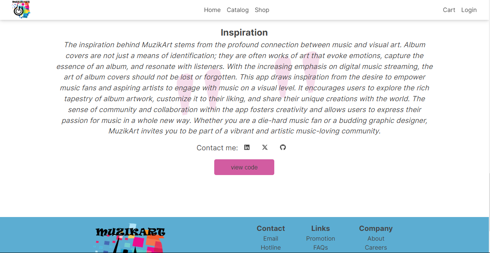

# MuzikArt - where artists and creatives meet

## Introduction

MuzikArt is a creative platform that allows you to explore, customize, upload, and share musical album artwork. Dive into the visual side of music, discover iconic designs and take ownership of your idea. Whether you're a music enthusiast or an aspiring artist, MuzikArt is the place where music meets art.

- **Live Demo**: [MuzikArt App](https://muzikart.vercel.app/)

- **Project Blog Article**: [Read our Blog](Link to your final project blog article)

- **Author(s) LinkedIn Profiles**:
  - [Dayo Farayola](https://www.linkedin.com/in/abdulmuiz-farayola-8a8484224/)

## Visit
Check out the website [here](https://muzikart.vercel.app/)

## Installation

To get started with this app, clone down all of its components. You will need `node` installed on your machine as well as `npm`.

This is a [Next.js](https://nextjs.org/) project bootstrapped with [`create-next-app`](https://github.com/vercel/next.js/tree/canary/packages/create-next-app).

To get started with muzikart on your local machine, follow these steps:

1. Clone the repository:
    - git clone https://github.com/s8nclone/muzikart.git 

2. Navigate to the project directory:
    - cd muzikart

3. Install the dependencies:
    - npm install

4. Start the development server:
    - npm run dev

5. Open your browser and visit http://localhost:3000 to access MuizArt locally.

## Usage
MuizikArt offers a wide range of features:

- Browse a vast collection of musical album artwork.
- Customize existing covers or design your own with intuitive editing tools.
- Download and share your customized and created artwork.
- Discover new music based on your edited covers and music preferences.
- Connect with other music and art enthusiasts for collaboration and inspiration.

## Contributing
We welcome contributions from the community!

## Related Projects
Check out these related projects for more inspiration
 - [project1](link)
 - [project2](link)

## Licensing
This project is licensed under the MIT License. You are free to use, modify, and distribute this software as long as you retain the original copyright notice.
